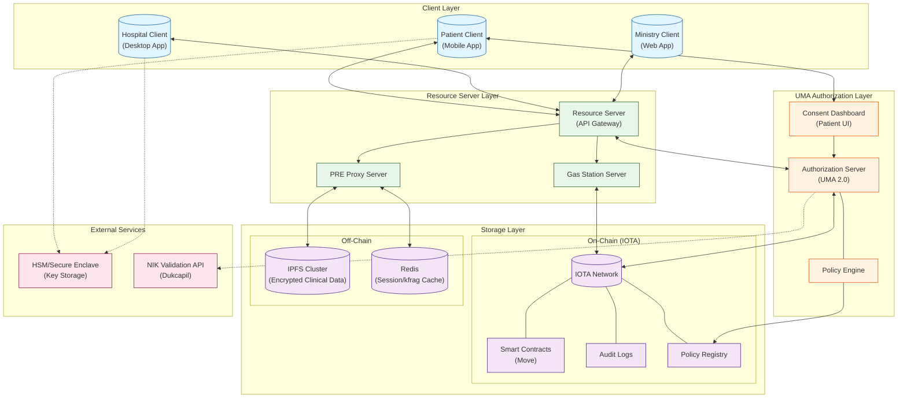
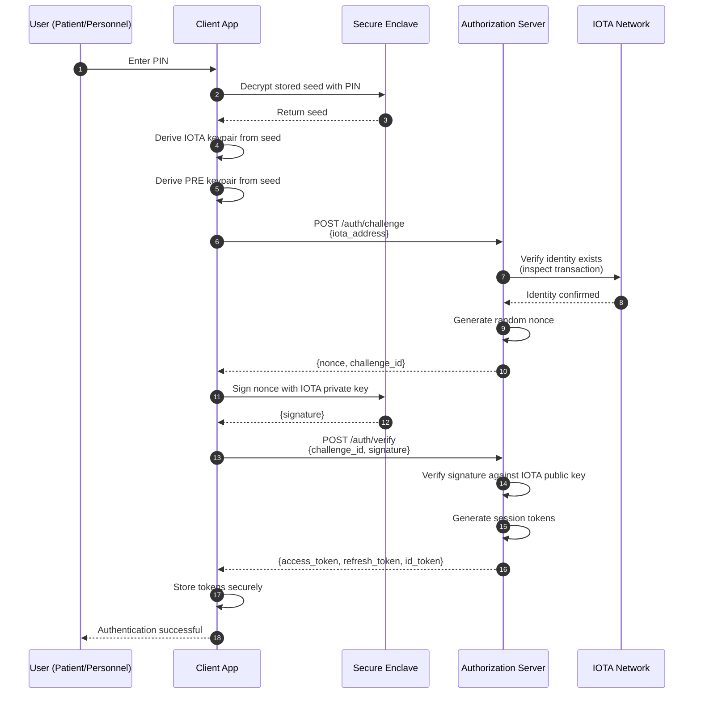
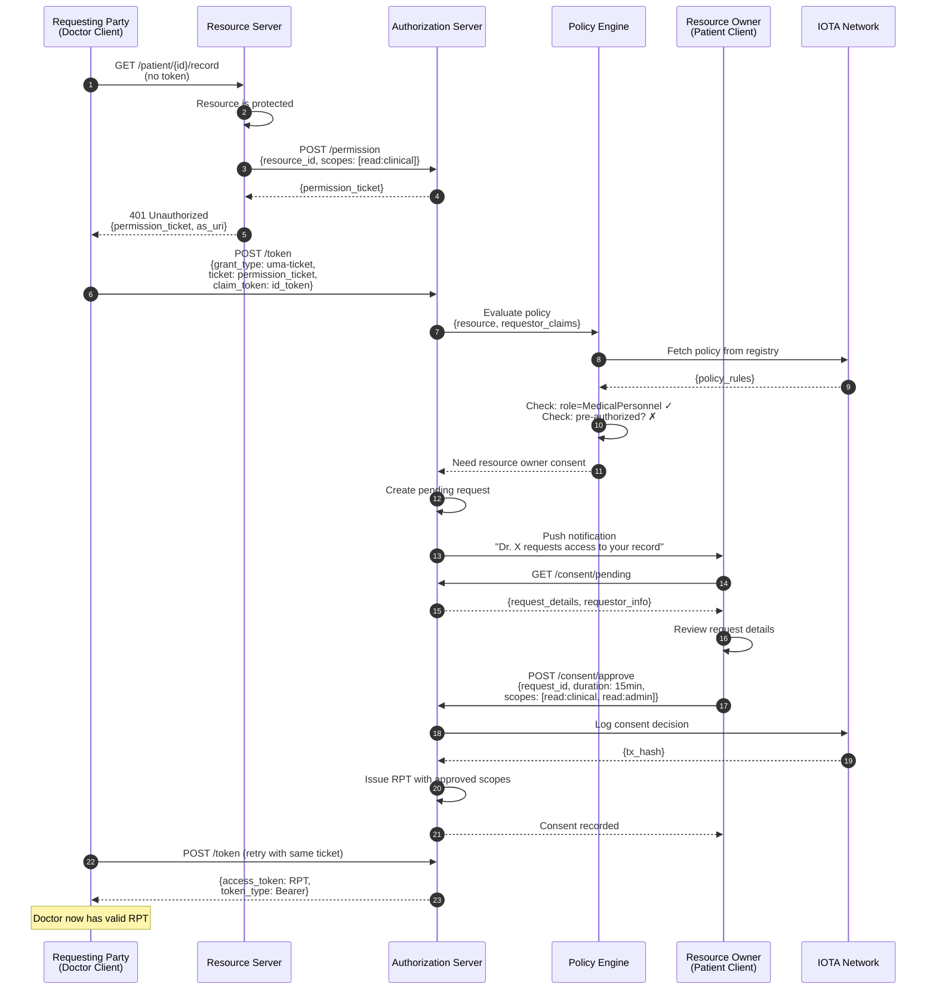
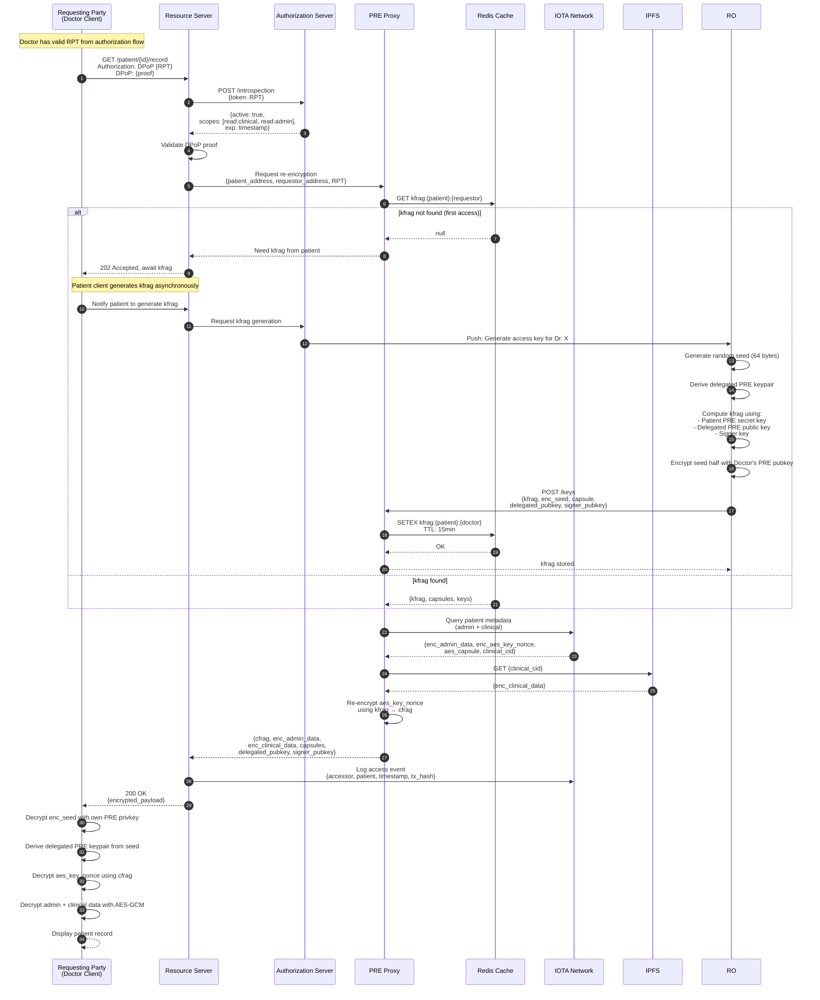
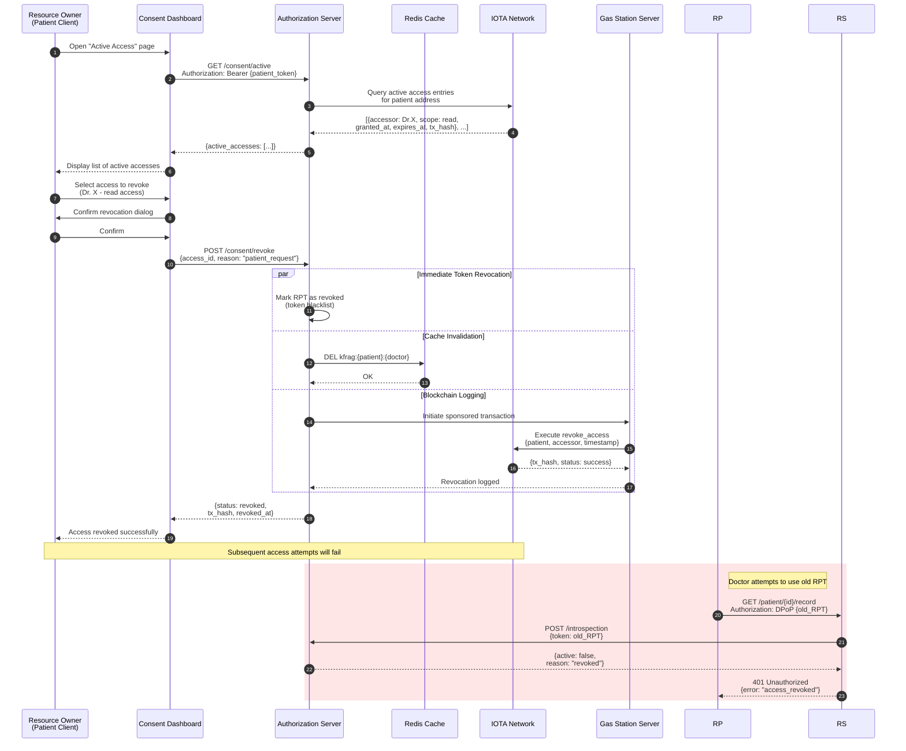

# DecMed UMA Architecture

This document describes the system architecture for integrating User-Managed Access (UMA 2.0) with Proxy Re-Encryption (PRE) in the DecMed medical record management framework.

## System Architecture



## Component Description

| Component | Purpose | Technology |
|-----------|---------|------------|
| **Patient Client** | Mobile app for patients to manage consent, view EMR | React Native / Flutter |
| **Hospital Client** | Desktop app for healthcare personnel | Tauri / Electron |
| **Ministry Client** | Web app for Kemenkes to register hospitals | Next.js |
| **Authorization Server** | UMA 2.0 compliant token issuer and policy evaluator | Keycloak / Custom |
| **Consent Dashboard** | Patient-facing UI for consent management | Embedded in Patient Client |
| **Policy Engine** | Evaluates access policies against claims | OPA (Open Policy Agent) |
| **Resource Server** | API Gateway protecting medical record endpoints | Go / Rust |
| **PRE Proxy Server** | Performs proxy re-encryption operations | Python (umbral library) |
| **Gas Station Server** | Sponsors IOTA transactions | IOTA SDK |
| **IOTA Network** | DLT for immutable audit logs and policy storage | IOTA Rebased |
| **IPFS Cluster** | Distributed storage for encrypted clinical data | IPFS |
| **Redis** | Cache for sessions, kfrags, nonces | Redis |

---

## Sequence Diagrams

### 1. Authentication Flow

Patient and healthcare personnel authentication using IOTA-based identity.



### 2. Authorization Flow (UMA Grant)

Healthcare personnel requesting access to patient's medical record.



### 3. Providing Access Flow (with PRE)

After authorization, the actual data access with proxy re-encryption.



### 4. Revoking Access Flow

Patient revoking previously granted access.



---

## Security Considerations

### Token Security

| Mechanism | Purpose |
|-----------|---------|
| **DPoP** | Binds tokens to client keypair, prevents token theft |
| **Short TTL** | Limits exposure window (5-15 min access tokens) |
| **Refresh Rotation** | New refresh token on each use, detects theft |
| **Introspection** | Real-time token validation before access |

### Cryptographic Guarantees

| Layer | Mechanism |
|-------|-----------|
| **Transport** | mTLS between all services |
| **Data at Rest** | AES-256-GCM encryption |
| **Delegation** | Proxy Re-Encryption (Umbral) |
| **Audit** | IOTA immutable ledger |

### Consent Properties

| Property | Implementation |
|----------|----------------|
| **Explicit** | Push notification + manual approval |
| **Granular** | Per-resource, per-scope consent |
| **Time-bound** | Configurable expiration |
| **Revocable** | Immediate via AS + delayed via blockchain |
| **Auditable** | All decisions logged to IOTA |

---

## Policy Example

```json
{
  "policy_id": "emr_access_policy_v1",
  "resource_type": "patient_emr",
  "rules": [
    {
      "effect": "permit",
      "conditions": {
        "requestor_role": ["MedicalPersonnel"],
        "scopes": ["read:clinical", "read:admin", "write:clinical"],
        "requires_consent": true,
        "max_duration_minutes": 120
      }
    },
    {
      "effect": "permit", 
      "conditions": {
        "requestor_role": ["AdministrativePersonnel"],
        "scopes": ["read:admin"],
        "requires_consent": true,
        "max_duration_minutes": 15
      }
    },
    {
      "effect": "deny",
      "conditions": {
        "time_of_day": {"before": "06:00", "after": "22:00"},
        "unless": {"context": "emergency"}
      }
    }
  ]
}
```
