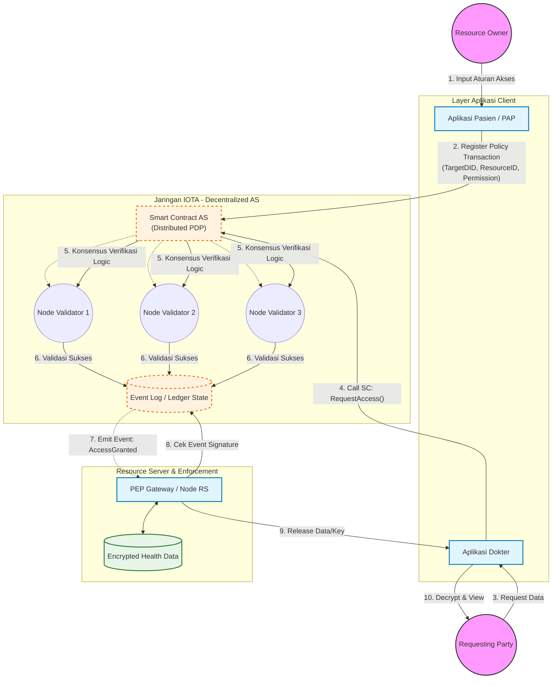

# Arsitektur DecMed dengan Decentralized UMA

## Penjelasan Komponen

### Actors
- **Resource Owner (Pasien)**: Pemilik data rekam medis yang mendefinisikan kebijakan akses
- **Requesting Party (Dokter)**: Pihak yang meminta akses ke data rekam medis

### Layer Aplikasi Client
- **Aplikasi Pasien/PAP**: Portal consent untuk pasien mengelola kebijakan akses
- **Aplikasi Dokter**: Interface untuk tenaga medis mengakses data pasien

### Jaringan IOTA - Decentralized AS
- **Smart Contract AS**: Authorization Server terdistribusi yang menjalankan Policy Decision Point (PDP)
- **Node Validator**: Node-node yang melakukan konsensus untuk verifikasi kebijakan
- **Event Log**: Ledger state yang menyimpan log akses dan keputusan otorisasi

### Resource Server & Enforcement
- **PEP Gateway**: Policy Enforcement Point yang menegakkan keputusan otorisasi
- **Encrypted Health Data**: Storage terenkripsi untuk data rekam medis

## Alur Kerja

1. **Definisi Policy**: Pasien mendefinisikan aturan akses melalui aplikasi
2. **Register Transaction**: Policy didaftarkan ke smart contract di IOTA
3. **Request Access**: Dokter meminta akses data melalui aplikasinya
4. **Smart Contract Verification**: Smart contract memverifikasi permintaan
5. **Distributed Consensus**: Node validator melakukan konsensus
6. **Log Event**: Hasil validasi dicatat di event log
7. **Emit Event**: Event aksess granted dikirim ke PEP
8. **Signature Check**: PEP memverifikasi signature event
9. **Release Data**: PEP memberikan akses/key ke dokter
10. **View Data**: Dokter dapat dekripsi dan melihat data
