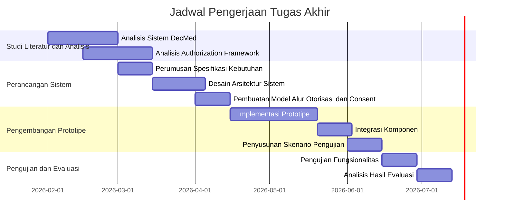

# Jadwal Pengerjaan Tugas Akhir

## Penjelasan Timeline

### Februari - Maret 2026: Studi Literatur dan Analisis Sistem Saat Ini
- **Analisis Sistem DecMed** (4 minggu): Eksplorasi dan pengumpulan informasi terkait DecMed, termasuk arsitektur, mekanisme akses kontrol, dan tech-stack.
- **Analisis Authorization Framework** (4 minggu): Studi literatur mengenai authorization framework, prinsip kerja, komponen utama, dan penerapannya.

### Maret - April 2026: Perancangan Arsitektur dan Desain Sistem
- **Perumusan Spesifikasi Kebutuhan** (2 minggu): Menyusun spesifikasi kebutuhan sistem berdasarkan hasil identifikasi masalah.
- **Desain Arsitektur Sistem** (3 minggu): Mendesain arsitektur sistem yang mengintegrasikan authorization framework dan portal consent.
- **Pembuatan Model Alur Otorisasi dan Consent** (2 minggu): Menyusun model alur otorisasi dan pengelolaan persetujuan.

### April - Juni 2026: Pengembangan Prototipe Sistem
- **Implementasi Prototipe** (5 minggu): Mengimplementasikan prototipe sistem sesuai desain.
- **Integrasi Komponen** (2 minggu): Integrasi antara komponen authorization framework dan portal consent dengan DecMed.
- **Penyusunan Skenario Pengujian** (2 minggu): Menyusun skenario penggunaan dan pengujian.

### Juni - Juli 2026: Pengujian dan Evaluasi
- **Pengujian Fungsionalitas** (2 minggu): Pengujian pemberian dan pencabutan akses, pengelolaan persetujuan, dan keamanan data.
- **Analisis Hasil Evaluasi** (2 minggu): Menganalisis hasil pengujian untuk menilai pencapaian tujuan.
