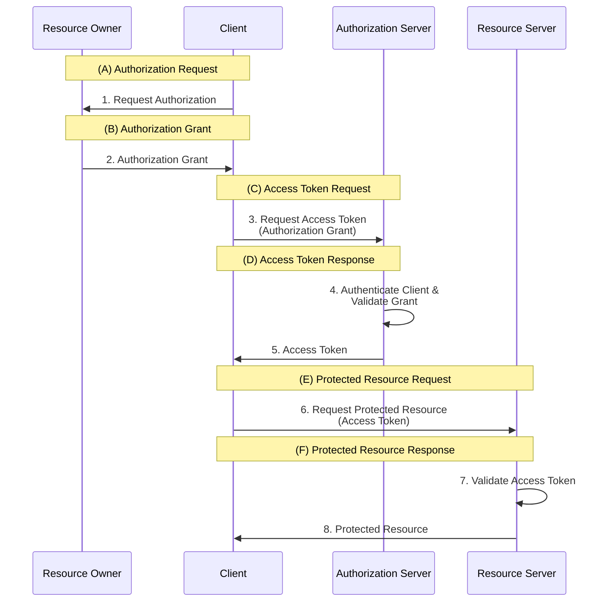

# OAuth 2.0 Protocol Flow

## Abstract Protocol Flow

## Penjelasan Alur

### (A) Authorization Request

Client meminta otorisasi dari Resource Owner. Permintaan otorisasi dapat dilakukan secara langsung kepada Resource Owner atau secara tidak langsung melalui Authorization Server sebagai perantara.

### (B) Authorization Grant

Client menerima authorization grant, yang merupakan kredensial yang mewakili otorisasi Resource Owner. Authorization grant dapat menggunakan salah satu dari empat tipe grant yang didefinisikan dalam spesifikasi OAuth 2.0 atau menggunakan extension grant type.

### (C) Access Token Request

Client meminta access token dengan mengautentikasi diri ke Authorization Server dan menyajikan authorization grant.

### (D) Access Token Response

Authorization Server mengautentikasi Client dan memvalidasi authorization grant. Jika valid, Authorization Server mengeluarkan access token.

### (E) Protected Resource Request

Client meminta protected resource dari Resource Server dan mengautentikasi diri dengan menyajikan access token.

### (F) Protected Resource Response

Resource Server memvalidasi access token, dan jika valid, melayani permintaan dengan memberikan protected resource.

## Komponen Utama

- **Authorization Grant**: Kredensial yang mewakili otorisasi Resource Owner
- **Access Token**: Token yang digunakan untuk mengakses protected resource
- **Client Authentication**: Proses autentikasi Client oleh Authorization Server
- **Token Validation**: Proses validasi access token oleh Resource Server
