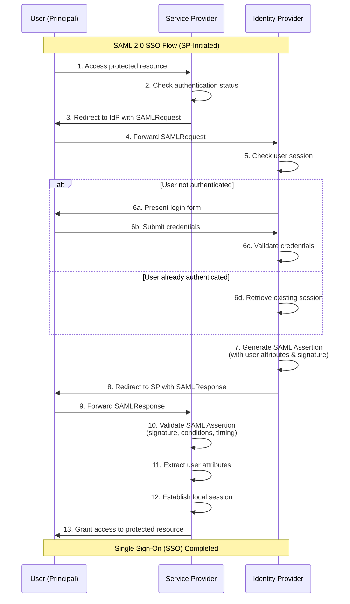

# SAML 2.0 Protocol Flow

```mermaid
sequenceDiagram
    participant U as User (Principal)
    participant SP as Service Provider
    participant IdP as Identity Provider

    Note over U,IdP: SAML 2.0 SSO Flow (SP-Initiated)

    %% Phase 1: Service Access Attempt
    U->>SP: 1. Access protected resource
    SP->>SP: 2. Check authentication status
    
    %% Phase 2: Authentication Request
    SP->>U: 3. Redirect to IdP with SAMLRequest
    U->>IdP: 4. Forward SAMLRequest
    
    %% Phase 3: User Authentication
    IdP->>IdP: 5. Check user session
    alt User not authenticated
        IdP->>U: 6a. Present login form
        U->>IdP: 6b. Submit credentials
        IdP->>IdP: 6c. Validate credentials
    else User already authenticated
        IdP->>IdP: 6d. Retrieve existing session
    end
    
    %% Phase 4: Assertion Generation
    IdP->>IdP: 7. Generate SAML Assertion<br/>(with user attributes & signature)
    IdP->>U: 8. Redirect to SP with SAMLResponse
    
    %% Phase 5: Assertion Validation & Session Establishment
    U->>SP: 9. Forward SAMLResponse
    SP->>SP: 10. Validate SAML Assertion<br/>(signature, conditions, timing)
    SP->>SP: 11. Extract user attributes
    SP->>SP: 12. Establish local session
    
    %% Phase 6: Resource Access
    SP->>U: 13. Grant access to protected resource
    
    Note over U,IdP: Single Sign-On (SSO) Completed
```
