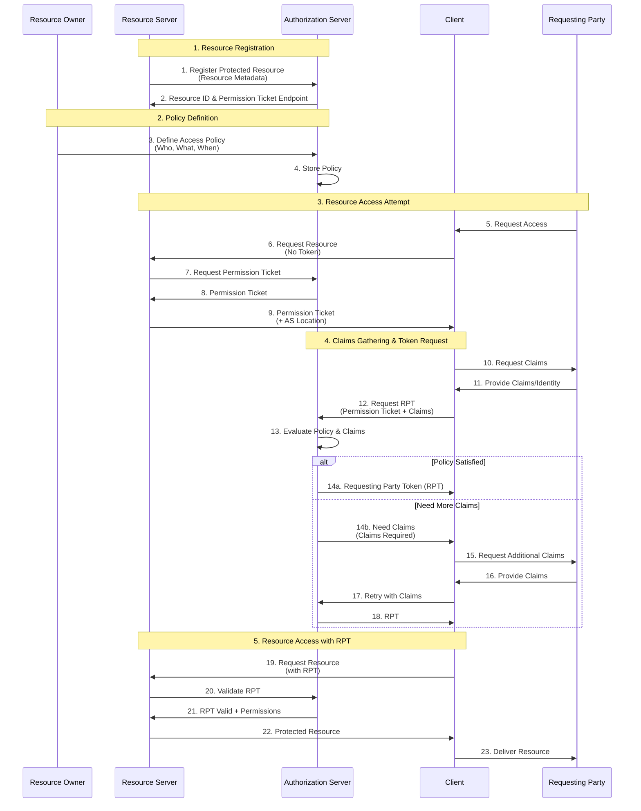

# UMA 2.0 Protocol Flow

## Abstract Protocol Flow

## Penjelasan Alur

### 1. Resource Registration

Resource Server mendaftarkan protected resource ke Authorization Server. Authorization Server mengembalikan resource ID dan endpoint untuk permission ticket yang akan digunakan dalam proses otorisasi selanjutnya.

### 2. Policy Definition

Resource Owner mendefinisikan kebijakan akses (policy) di Authorization Server, menentukan siapa (who), dapat mengakses apa (what), dan kapan (when). Authorization Server menyimpan kebijakan ini untuk evaluasi di masa mendatang.

### 3. Resource Access Attempt

Requesting Party mencoba mengakses resource melalui Client. Client meminta resource ke Resource Server tanpa token. Resource Server meminta permission ticket dari Authorization Server dan memberikannya ke Client bersama lokasi Authorization Server.

### 4. Claims Gathering & Token Request

Client meminta claims (bukti identitas/atribut) dari Requesting Party. Client kemudian meminta Requesting Party Token (RPT) dari Authorization Server dengan menyertakan permission ticket dan claims. Authorization Server mengevaluasi kebijakan yang telah didefinisikan Resource Owner terhadap claims yang diberikan.

Jika kebijakan terpenuhi, Authorization Server mengeluarkan RPT. Jika claims tidak cukup, Authorization Server meminta claims tambahan, dan proses diulang hingga kebijakan terpenuhi atau ditolak.

### 5. Resource Access with RPT

Client menggunakan RPT untuk mengakses protected resource dari Resource Server. Resource Server memvalidasi RPT dengan Authorization Server. Jika valid, Resource Server memberikan protected resource kepada Client, yang kemudian diteruskan ke Requesting Party.

## Perbedaan Utama dengan OAuth 2.0

1. **Asynchronous Authorization**: Resource Owner dapat mendefinisikan policy kapan saja, tidak harus saat access request
2. **Party-to-Party Sharing**: Fokus pada sharing antar individu/entitas, bukan user-to-app
3. **Claims-Based**: Menggunakan claims gathering untuk policy evaluation yang lebih granular
4. **Permission Ticket**: Mekanisme khusus untuk mengelola permission request
5. **Requesting Party Token (RPT)**: Token khusus yang membawa permission yang sudah dievaluasi

## Komponen Utama

- **Resource ID**: Identifier unik untuk protected resource
- **Permission Ticket**: Token sementara yang merepresentasikan permission request
- **Claims**: Atribut atau bukti identitas dari Requesting Party
- **Policy**: Aturan akses yang didefinisikan oleh Resource Owner
- **Requesting Party Token (RPT)**: Token yang membawa authorized permissions
