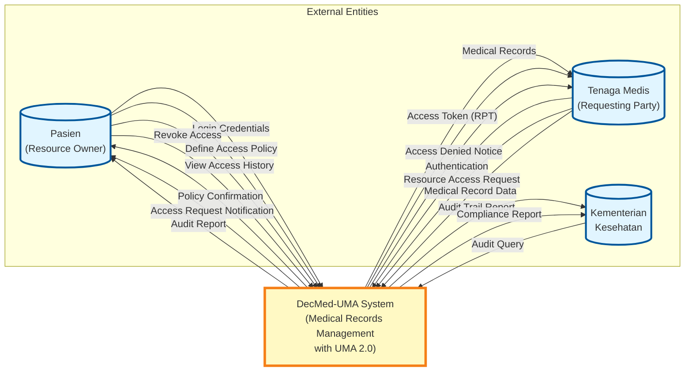
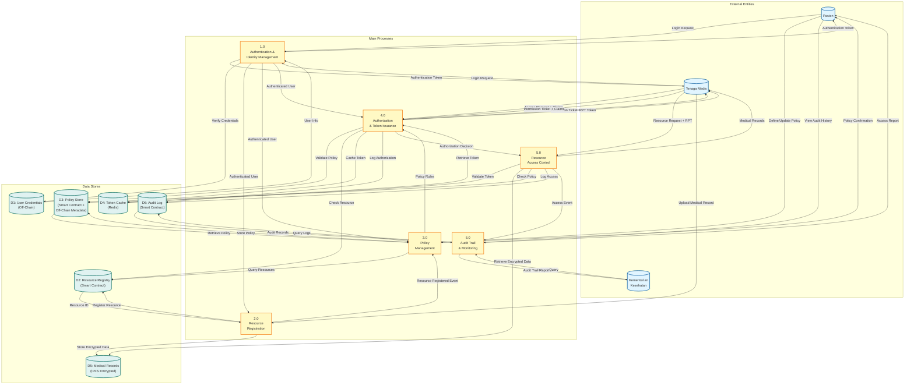
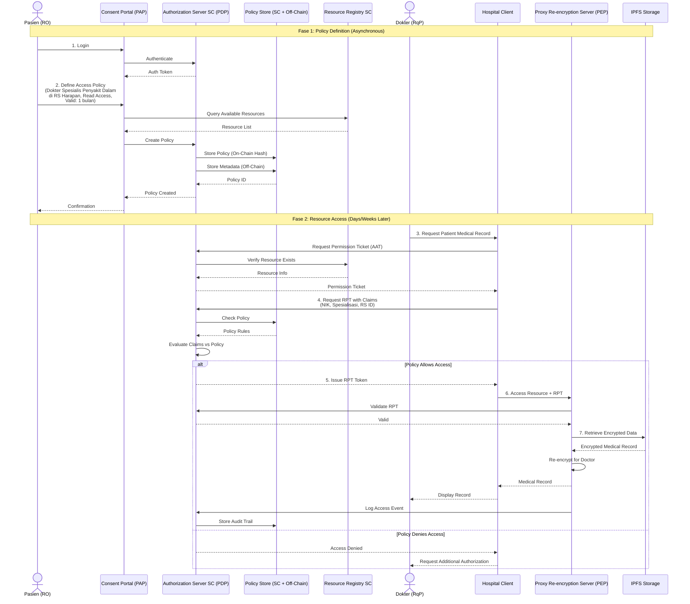

# Arsitektur DecMed dengan UMA 2.0 dan Patient Consent Portal

## 1. Diagram Arsitektur Sistem

```mermaid
graph TB
    subgraph "Patient"
        Patient[("Pasien<br/>(Resource Owner)")]
    end
    
    subgraph "Medical Personnel"
        Doctor[("Dokter")]
        Nurse[("Perawat")]
        Admin[("Admin Fasyankes")]
    end
    
    subgraph "External Entity"
        MinHealth[("Kementerian<br/>Kesehatan")]
        OtherFasyankes[("Fasyankes<br/>Lain")]
    end
    
    subgraph "Client Layer"
        ConsentPortal["Patient Consent Portal<br/>(PAP - Policy Admin Point)<br/>[Web/Mobile App]"]
        HospitalClient["Hospital Client<br/>[Desktop App]"]
        MinistryClient["Ministry Client<br/>[Desktop App]"]
    end
    
    subgraph "IOTA Network - Smart Contract Layer"
        direction TB
        AuthzSC["Authorization Server<br/>Smart Contract<br/>(PDP - Policy Decision Point)"]
        ResourceSC["Resource Registration<br/>Smart Contract"]
        PolicySC["Policy Storage<br/>Smart Contract"]
        AuditSC["Audit Trail<br/>Smart Contract"]
    end
    
    subgraph "Backend Services"
        ProxyReEnc["Proxy Re-encryption<br/>Server<br/>(PEP - Policy Enforcement Point)<br/>[REST Backend]"]
        TokenService["Token Service<br/>(Issue PAT/AAT/RPT)"]
        ClaimsGathering["Claims Gathering<br/>Service"]
    end
    
    subgraph "Storage Layer"
        Redis[("Redis<br/>(Session & Cache)")]
        IPFS[("IPFS<br/>(Medical Records<br/>Encrypted Storage)")]
        OffChainDB[("Off-Chain Database<br/>(Policy Metadata)")]
    end
    
    subgraph "IOTA Infrastructure"
        GasStation1["IOTA Gas Station<br/>Server"]
        GasStation2["IOTA Gas Station<br/>Server"]
        IOTANetwork["IOTA Network<br/>(DLT)"]
    end
    
    %% Patient Interactions
    Patient -->|"1. Login &<br/>Define Policy"| ConsentPortal
    Patient -->|"8. Sponsored Tx"| GasStation1
    
    %% Medical Personnel Interactions
    Doctor -->|"Request Access"| HospitalClient
    Nurse -->|"Request Access"| HospitalClient
    Admin -->|"Register Resources"| HospitalClient
    
    %% Ministry Interactions
    MinHealth -->|"Monitor & Audit"| MinistryClient
    
    %% External Requesting Party
    OtherFasyankes -->|"Request Access<br/>via Claims"| HospitalClient
    
    %% Consent Portal Flow
    ConsentPortal -->|"2. Create/Update<br/>Policy"| AuthzSC
    ConsentPortal -->|"Store Policy<br/>Metadata"| OffChainDB
    ConsentPortal -->|"View Resources"| ResourceSC
    
    %% Hospital Client Flow
    HospitalClient -->|"3. Register<br/>Resource (PAT)"| ResourceSC
    HospitalClient -->|"4. Request<br/>Permission (AAT)"| AuthzSC
    HospitalClient -->|"5. Access<br/>Resource (RPT)"| ProxyReEnc
    HospitalClient -->|"Sponsored Tx"| GasStation2
    
    %% Ministry Client Flow
    MinistryClient -->|"Query Audit<br/>Trail"| AuditSC
    MinistryClient -->|"Sponsored Tx"| GasStation2
    
    %% Authorization Server Smart Contract
    AuthzSC -->|"Validate Policy"| PolicySC
    AuthzSC -->|"Check Resource"| ResourceSC
    AuthzSC -->|"Log Access"| AuditSC
    AuthzSC -->|"Retrieve Policy<br/>Metadata"| OffChainDB
    AuthzSC -->|"Issue Tokens"| TokenService
    
    %% Token Service
    TokenService -->|"Cache Tokens"| Redis
    TokenService -->|"Validate Claims"| ClaimsGathering
    
    %% Claims Gathering
    ClaimsGathering -->|"Verify Attributes"| OffChainDB
    
    %% Proxy Re-encryption Server (PEP)
    ProxyReEnc -->|"6. Validate Token<br/>(RPT)"| AuthzSC
    ProxyReEnc -->|"7. Retrieve<br/>Encrypted Data"| IPFS
    ProxyReEnc -->|"Re-encrypt &<br/>Return Data"| HospitalClient
    ProxyReEnc -->|"Cache"| Redis
    
    %% IOTA Network Integration
    GasStation1 -->|"Submit Transaction"| IOTANetwork
    GasStation2 -->|"Submit Transaction"| IOTANetwork
    IOTANetwork -->|"Deploy/Execute"| AuthzSC
    IOTANetwork -->|"Deploy/Execute"| ResourceSC
    IOTANetwork -->|"Deploy/Execute"| PolicySC
    IOTANetwork -->|"Deploy/Execute"| AuditSC
    
    %% Styling
    classDef actor fill:#e1f5ff,stroke:#01579b,stroke-width:2px
    classDef client fill:#fff9c4,stroke:#f57f17,stroke-width:2px
    classDef smartcontract fill:#e8eaf6,stroke:#3f51b5,stroke-width:2px
    classDef backend fill:#f3e5f5,stroke:#7b1fa2,stroke-width:2px
    classDef storage fill:#e0f2f1,stroke:#00695c,stroke-width:2px
    classDef infra fill:#fce4ec,stroke:#c2185b,stroke-width:2px
    
    class Patient,Doctor,Nurse,Admin,MinHealth,OtherFasyankes actor
    class ConsentPortal,HospitalClient,MinistryClient client
    class AuthzSC,ResourceSC,PolicySC,AuditSC smartcontract
    class ProxyReEnc,TokenService,ClaimsGathering backend
    class Redis,IPFS,OffChainDB storage
    class GasStation1,GasStation2,IOTANetwork infra
```

## 2. Data Flow Diagram (DFD) Level 0 - Context Diagram



## 3. Data Flow Diagram (DFD) Level 1 - Process Decomposition



## 4. Sequence Diagram - Asynchronous Policy Definition & Access Flow



## 5. Komponen Utama UMA 2.0 dalam Arsitektur DecMed

### 5.1 Pemetaan Komponen UMA ke DecMed

| Komponen UMA 2.0                    | Implementasi DecMed                     | Teknologi                   |
| ----------------------------------- | --------------------------------------- | --------------------------- |
| Resource Owner (RO)                 | Pasien                                  | Mobile/Web App              |
| Resource Server (RS)                | Fasyankes/Hospital System               | Desktop Client + IPFS       |
| Authorization Server (AS)           | Smart Contract on IOTA                  | IOTA Smart Contract         |
| Requesting Party (RqP)              | Tenaga Medis/Fasyankes Lain             | Desktop/Mobile Client       |
| Policy Administration Point (PAP)   | Patient Consent Portal                  | Web/Mobile App              |
| Policy Decision Point (PDP)         | Authorization Server Smart Contract     | IOTA Smart Contract         |
| Policy Enforcement Point (PEP)      | Proxy Re-encryption Server              | REST Backend                |
| Policy Storage                      | Hybrid: On-Chain + Off-Chain            | Smart Contract + Database   |

### 5.2 Token Flow dalam Sistem

1. **PAT (Protection API Token)**: Diterbitkan untuk Resource Server (Fasyankes) saat mendaftarkan resource
2. **AAT (Authorization API Token)**: Diterbitkan untuk Requesting Party yang terautentikasi
3. **Permission Ticket**: Diterbitkan saat Requesting Party meminta akses ke resource
4. **RPT (Requesting Party Token)**: Token akhir yang memberikan akses setelah policy evaluation

### 5.3 Granularitas Akses

Patient dapat mendefinisikan policy dengan granularitas:

- **Data**: Specific FHIR resources (Observation, Medication, DiagnosticReport, dll)
- **Pihak**: Individual (NIK), Role (Dokter, Perawat), Organization (RS ID)
- **Aksi**: Read, Write, Delete
- **Waktu**: Start date, End date, Duration
- **Kondisi**: Emergency access, Referral code, Specialization

### 5.4 Desentralisasi

- **Authorization Server**: Smart Contract on IOTA (terdesentralisasi)
- **Resource Storage**: IPFS (decentralized storage)
- **Policy Metadata**: Off-chain database (dapat dipilih per fasyankes)
- **Audit Trail**: Immutable record on IOTA blockchain

## 6. Keunggulan Arsitektur

1. **Asynchronous Authorization**: Pasien dapat mendefinisikan policy di masa lalu tanpa harus hadir saat akses
2. **Granular Access Control**: Fine-grained policy dengan claims-based evaluation
3. **Decentralized**: Authorization logic di smart contract, data di IPFS
4. **Immutable Audit**: Semua akses tercatat di blockchain
5. **Scalable**: Off-chain metadata untuk policy yang kompleks
6. **Interoperable**: Mendukung standar FHIR dan UMA 2.0
7. **Privacy-Preserving**: Proxy re-encryption untuk data protection
8. **Cost-Effective**: Sponsored transaction via IOTA Gas Station
